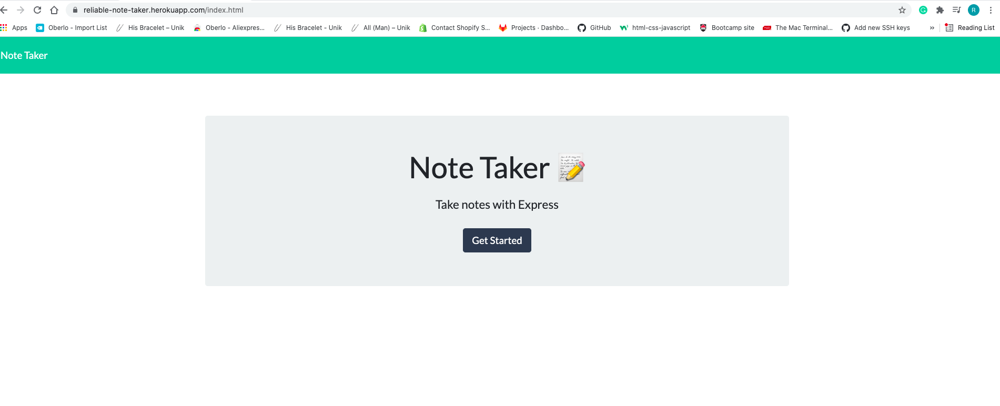
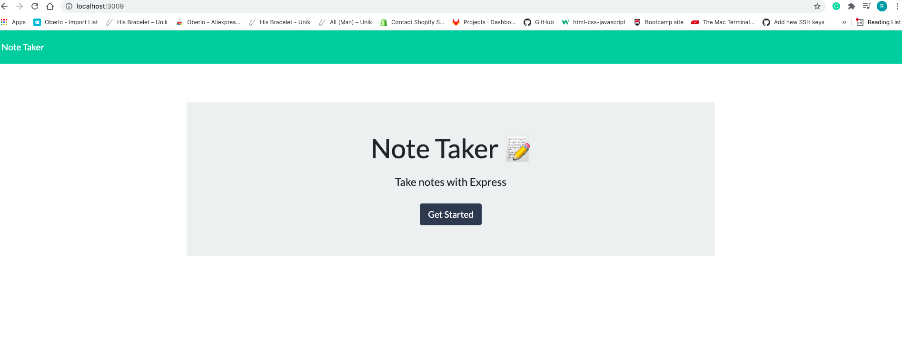
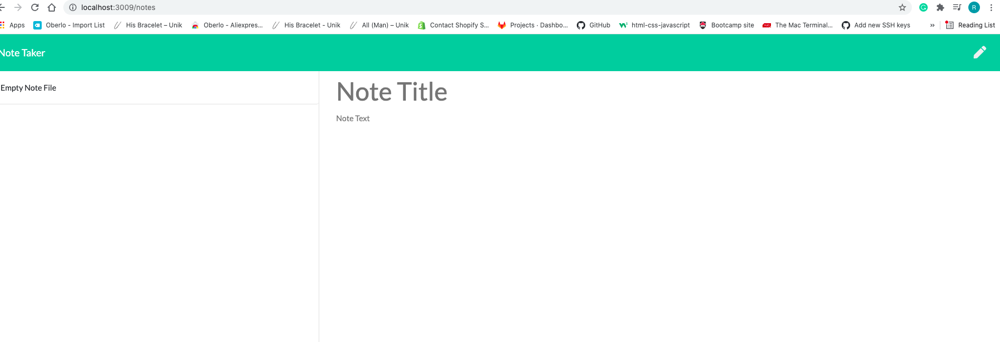

# note-taker

Deployable Link - > https://git.heroku.com/reliable-note-taker.git

# Description:
A web application that is able to write and save notes
SO THAT I can organize my thoughts and keep track of tasks I need to complete.

# Criteria
GIVEN a note-taking application
* WHEN I open the Note Taker
THEN I am presented with a landing page with a link to a notes page
* WHEN I click on the link to the notes page
THEN I am presented with a page with existing notes listed in the left-hand column, plus empty fields to enter a new note title and the note’s text in the right-hand column
* WHEN I enter a new note title and the note’s text
THEN a Save icon appears in the navigation at the top of the page
* WHEN I click on the Save icon
THEN the new note I have entered is saved and appears in the left-hand column with the other existing notes
* WHEN I click on an existing note in the list in the left-hand column
THEN that note appears in the right-hand column
* WHEN I click on the Write icon in the navigation at the top of the page
THEN I am presented with empty fields to enter a new note title and the note’s text in the right-hand column.

# Installation needed:
* Install npm express
* Install npm shortid

# Screenshots:

# Test Command:
The server is running under localhost:3009 in browser.

# Personal Note

I deployed the app on Heroku. You can use the link the Link above to look and use It. If the application is empty the save Button won't show, just to prevent any temptations. It will show, once you add an actual text content. Eveything is saved on the db.json file. All the Buttons work. Had an issue with the notes not populating and deleting automatically. I had to refresh. But It's fixed. Added Procfile to run heroku, as heroku suggested it.

Enjoy!